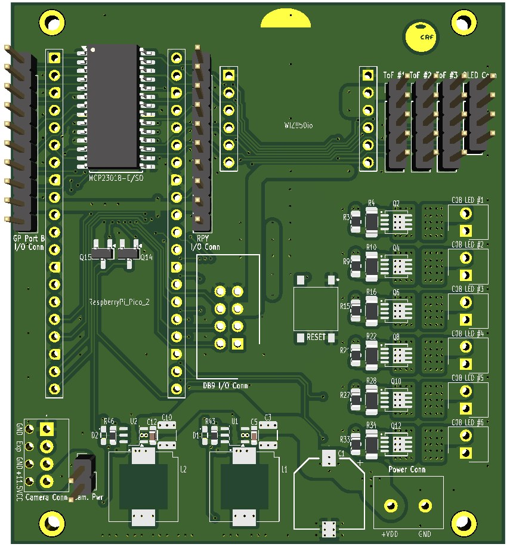

Designed by Giulio Vivo

# MagicianCam4

Current revision of the Magician camera/sensing board, built around a **Raspberry Pi Pico 2 (RP2350)** instead of the Arduino Nano used in [`v1/`](../v1/README.md). Firmware lives in [`src/pico2/`](../../pico2/).

Main changes over v1:

- **VL53L5CX multizone ToF sensor** (8x8 = 64 distance zones) replacing the 3x VL53L0X single-zone sensors.
- **MCP23018 I²C I/O expander** for buttons and light control, replacing the 74HC595 shift register chain.
- Exposure-synced LED strobing with per-COB thermal budgeting, since the LED COBs are driven above their rated voltage and rely on strict pulse-width/duty-cycle limits to survive.
- Ethernet connectivity kept compatible with the camera board.

See the MAGICIAN D3.3 deliverable for the background on the sensor/board redesign (split Main + LED-strobe + Ethernet board layout, move from Arduino Mega/Nano to a smaller microcontroller footprint).
